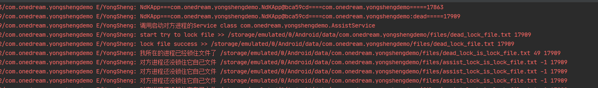
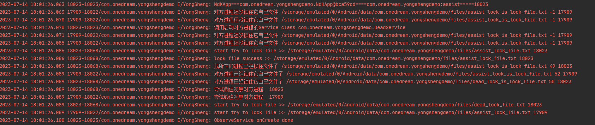
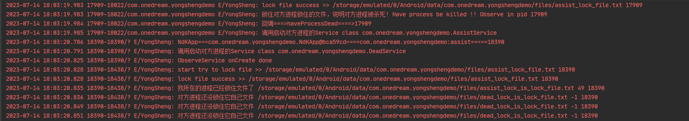
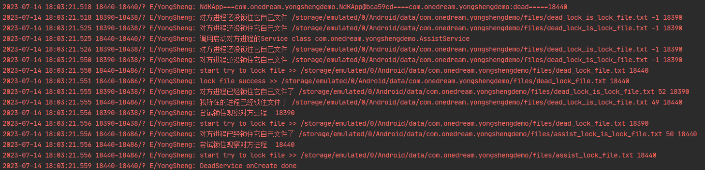

~~~~~~~
读了gityuan大佬的文章：
[深度剖析APP保活案例](http://gityuan.com/2018/02/24/process-keep-forever/)
想简单实现下，
在Github找到开源项目
[Android 保活神器](https://github.com/xinjianteng/Leoric)
本demo算是个学习笔记吧
~~~~~~~

~~~~~~~
运行项目，会先启动DeadService(即启动dead进程），
在YongShengProcess中：
dead进程会先锁住dead_lock_file.txt文件，然后启动AssistService(即启动assist进程），见：onSelfCreate方法
assist进程会尝试锁住dead_lock_file.txt，如果锁住文件成功，即dead进程被杀死，会回调haveProcessDead
assist进程杀死自己，然后启动DeadService(即启动dead进程）
~~~~~~~

~~~~~~~
adb shell kill 14237
~~~~~~~

互相观察启动对方

~~~~~~~
//adb命令杀死assist进程
adb shell kill 18203
~~~~~~~

