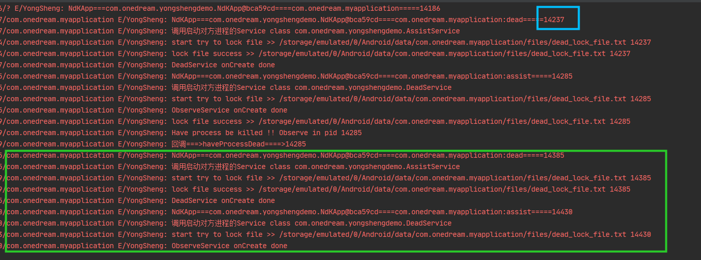

运行项目，会先启动DeadService(即启动dead进程），
在YongShengProcess中：
dead进程会先锁住dead_lock_file.txt文件，然后启动AssistService(即启动assist进程），见：onSelfCreate方法
assist进程会尝试锁住dead_lock_file.txt，如果锁住文件成功，即dead进程被杀死，会回调haveProcessDead
assist进程杀死自己，然后启动DeadService(即启动dead进程）

adb shell kill 14237
